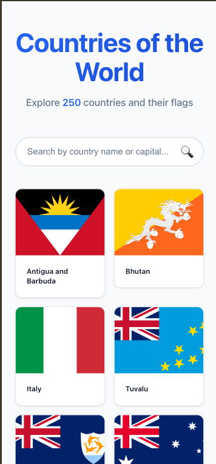

# Old Mutual Technical Assessment

A full-stack application that provides country information through a RESTful API.

## Screenshots

### Desktop View


### Mobile View


## Architecture

This project follows Clean Architecture principles with four layers:

- **Api** - Controllers, middleware, and HTTP configuration
- **Application** - Business logic, DTOs, and service interfaces
- **Domain** - Core entities and repository interfaces
- **Infrastructure** - External API clients, caching, and data access

## Project Structure

```
├── backend/          # .NET Core Web API
│   ├── src/
│   │   ├── CountryApi.Api/           # Web API layer
│   │   ├── CountryApi.Application/    # Application logic
│   │   ├── CountryApi.Domain/         # Domain entities
│   │   └── CountryApi.Infrastructure/ # External integrations
│   └── tests/
│       └── CountryApi.UnitTests/      # Unit tests
└── frontend/         # React + TypeScript frontend
    ├── src/
    │   ├── components/               # Reusable UI components
    │   ├── pages/                    # Route pages (HomePage, DetailPage)
    │   ├── hooks/                    # Custom React hooks
    │   ├── services/                 # API client services
    │   ├── types/                    # TypeScript type definitions
    │   ├── styles/                   # SCSS variables and global styles
    │   └── __tests__/                # Test files
    ├── public/                       # Static assets
    └── dist/                         # Production build output
```

## Technologies

- .NET 8
- ASP.NET Core Web API
- xUnit & FluentAssertions (Testing)
- Moq (Mocking)
- Memory Cache (Caching)

## Backend Setup

### Prerequisites

- [.NET SDK 8.0](https://dotnet.microsoft.com/download) or later
- IDE (Visual Studio, VS Code, or Rider)

### Running the API

```bash
cd backend
dotnet restore
cd src/CountryApi.Api
dotnet run
```

The API will be available at `http://localhost:5145/swagger` with Swagger UI

## API Endpoints

| Method | Endpoint | Description |
|--------|----------|-------------|
| GET | /countries | Retrieve all countries (name and flag) |
| GET | /countries/{name} | Retrieve details for a specific country |

### Example Responses

**GET /countries**
```json
[
  {
    "name": "South Africa",
    "flag": "https://flagcdn.com/w320/za.png"
  }
]
```

**GET /countries/South Africa**
```json
{
  "name": "South Africa",
  "population": 59308690,
  "capital": "Pretoria",
  "flag": "https://flagcdn.com/w320/za.png"
}
```

### Running Tests

```bash
cd backend
dotnet test
```

For coverage report:
```bash
cd backend
dotnet test --collect:"XPlat Code Coverage" --settings tests/CountryApi.UnitTests/coverlet.runsettings.xml
```

View the HTML coverage report at: `backend/tests/CountryApi.UnitTests/TestResults/{guid}/coverage.cobertura.xml`

**Test Coverage:** 80%+ across statements, branches, functions, and lines

## Frontend Setup

### Prerequisites

- [Node.js 20.x](https://nodejs.org/) or later
- npm (comes with Node.js)

### Environment Configuration

The frontend expects the backend API to be running. By default, it connects to `http://localhost:5145`.

To change the API URL, create a `.env` file in the `frontend` directory:

```bash
VITE_API_URL=http://localhost:5145
```

### Running the Application

**Important:** Start the backend API first (see Backend Setup above)

```bash
cd frontend
npm install
npm run dev
```

The application will be available at `http://localhost:5173`

### Running Tests

```bash
cd frontend
npm run test         # Run tests in watch mode
npm run test:run     # Run tests once
npm run test:coverage # Run tests with coverage report
```

**Test Coverage:** 95%+ across statements, branches, functions, and lines (33 passing tests)

### Linting

```bash
cd frontend
npm run lint        # Check for code quality issues
```

### Building for Production

```bash
cd frontend
npm run build
npm run preview     # Preview production build locally
```

### Tech Stack

- React 19 + TypeScript
- Vite (build tool)
- React Router (navigation)
- SCSS (styling with variables and mixins)
- Vitest + React Testing Library (testing)
- Modern React patterns (hooks, context, services)
---

**Assessment Date:** 15 January 2026
